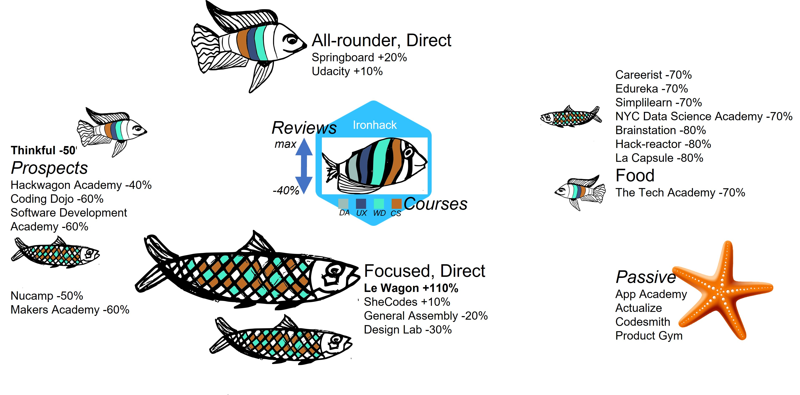

# Project: CLI - Competitive Landscape of Ironhack

## Overview

The AAA data analytics & consultancy firm comprises of three data analysts ([Aris Goulas](https://github.com/ArisGoulas), [Alvaro Gracio](https://github.com/alvarogracio), [Afonso Macedo](https://github.com/Afonso-Macedo)). They were recently hired by Ironhack, Portugal to perform an Analytics Consulting Project entitled: competitive landscape of Ironhack (cli).

---

## Project path

- A basic python notebook for obtaining data on competitor schools by using [SwitchUp](https://www.switchup.org/) was provided.
  - `regex`, `pandas` and `requests` (for making API calls, something tells me this will come back to us in the future...) were used
  - The data cleaning procedure was adapted to the project needs

- The initial notebook contained info on 3 schools (including Ironhack). The first task was to enrich it with a wider variety of schools
  - The top-25 schools based on their total number of reviews in the portal of switchup was used to populate the database further 

- The 5 obtained dataframes (comments, locations, courses, badges, schools) were imported to a SQL database.
  - `mysql.connector` and `sqlalchemy` were used to connect Python to mySQL and create the engine to be seeded and populated with data
  - As primary keys we selected: comment_id, school_id and location_id, while, in addition school_id was used as a foreign key as well

## Outcomes

- Once everything seemed to be in place, some basic queries were made using `mySQL`
  - First, the competitive landscape was mapped, categorizing the competitors of Ironhack based on two criteria in:
    - All-rounder (if the schools offered more than 2 courses, namely on Data Analytics, UX/UI, Web Development and Cybersecurity) or Focused (if the offered 2 or 1 courses); schools that for some (parsing) reasons appeared to offer 0 courses were marked as Passive
    - Direct (if their size, estimated by the number of reviews received, was similar to Ironhack; namely from 40% less to more than Ironhack's reviews), Prospects (for reviews equal to 40-60% less compared to Ironhack) and Food (for stakeholders with a small number of reviews)
   
  

- In total the :fishing_pole_and_fish: landscape comprises of:  
  - 2 All-rounder, Direct competitors (Springboard & Udacity)
  - 4 Focused, Direct competitors (Le Wagon, SheCodes, General Assembly & Design Lab)
  - 7 Prospect competitors
  - 8 Food competitors
  - 4 Passive competitors

- Based on their metrics, the identified competitors were sorted on top- :five: :
  - The number of courses offered (Ironhack offers 4): Springboard, Udacity, Thinkful & The Tech Academy (all 3)
  - Reviews (Ironhack had 1265): Le Wagon (+110%), Springboard ((+20%), Udacity and SheCodes (+10%)
  - Score (Ironhack had 4.74 ranking #09 overall): Le Capsule (4.96), Product Gym (4.94), Le Wagon (4.92), Codesmith (4.91) & SheCodes

- Some "food-for-though" was provided to the Ironhack decision makers! _Hint_ :ocean: 

 - Finally, the trend of score and reviews over :hourglass: was analyzed for two competitors of different nature (Le Wagon and Thinkful) indicating: 
   - A potential red flag for Ironhack's late score performance
   - The possibility that the ranking portal might be underperforming as compared to the past

---

## How to use

1. Clone this repo in your GitHub

2. Navigate to `your-code` and launch `sql_project_cli.ipynb` (i used `jupyter notebook` but feel free to use your favorite editor)
   - pay attention to the fact that as [SwitchUp](https://www.switchup.org/) changes the interface from time to time, it might be that some of the claims here will not be valid anymore; be critical about any of the results!
   - the script will generate and populate a database called cli; you need to modify in the connector details the path and password for your version of SQL
   - update function is a future feature :expressionless:

3.  This database is built for mySQL, therefore using it you should be able to execute the queries `of cli_queries.sql`
