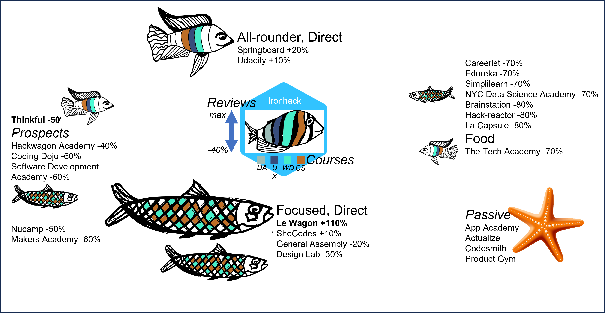

# Project: CLI - Competitive Landscape of Ironhack

## Overview

The AAA data analytics & consultancy firm comprises of three data analysts ([Aris Goulas](https://github.com/ArisGoulas), [Alvaro Gracio](https://github.com/alvarogracio), [Afonso Macedo](https://github.com/Afonso-Macedo)). They were recently hired by Ironhack, Portugal to perform an Analytics Consulting Project entitled: competitive landscape of Ironhack (cli).
You were hired by Ironhack to perform an Analytics Consulting Project entitled: competitive landscape.

Your mission is to create and populate an appropriate database with many coding schools that are our competition, as well as design an suitable queries that answer business questions of interest (to be defined by you)

---

## Project path

- A basic python notebook for obtaining data on competitor schools by using [SwitchUp](https://www.switchup.org/) was provided.
  - `regex`, `pandas` and `requests` (for making API calls, something tells me this will come back to us in the future...) were used
  - The data cleaning procedure was adapted to the project needs

- The initial notebook contained info on 3 schools (including Ironhack). The first task was to enrich it with a wider variety of schools
  - The top-25 schools based on their total number of reviews in the portal of switchup was used to populate the database further 

- The 5 obtained dataframes (comments, locations, courses, badges, schools) were imported to a SQL database.
  - `mysql.connector` and `sqlalchemy` were used to connect Python to mySQL and create the engine to be seeded and populated with data
  - The ERD of the database is included below, showing the primary keys selected (comment_id, school_id and location_id)
  - In addition, school_id was used as foreign key for all 5 tables

  

- Once everything seemed to be in place, some basic queries were made using `mySQL`
  - First, the competitive landscape was mapped, categorizing the competitors of Ironhack based on two criteria in:
    - All-rounder (if the schools offered more than 2 courses, namely on Data Analytics, UX/UI, Web Development and Cybersecurity) or Focused (if the offered 2 or 1 courses); schools that for some (parsing) reasons appeared to offer 0 courses were marked as "Passive"
    - Direct (if their size, estimated by the number of reviews received, was similar to Ironhack; namely from 40% less to more than Ironhack's reviews), Prospects (for reviews equal to 40-60% less compared to Ironhack) and "Food" (for stakeholders with a small number of reviews)
   
  

- Once you have the schemas you want, you will need to:
  - create the suitable SQL queries to create the tables and populate them
  - run these queries using the appropriate Python connectors

- Bonus: How will this datamodel be updated in the future? Please write auxiliary functions that test the database for data quality issues. For example: how could you make sure you only include the most recent comments when you re-run the script?

### Suggested Deliverables

- 5-6 minute presentation of data model created, decision process and business analysis proposed

- exported .sql file with the final schema

- Supporting python files used to generate all logic

- High level documentation explaining tables designed and focusing on update methods

Crucial hint: check out the following tutorial: https://www.dataquest.io/blog/sql-insert-tutorial/
